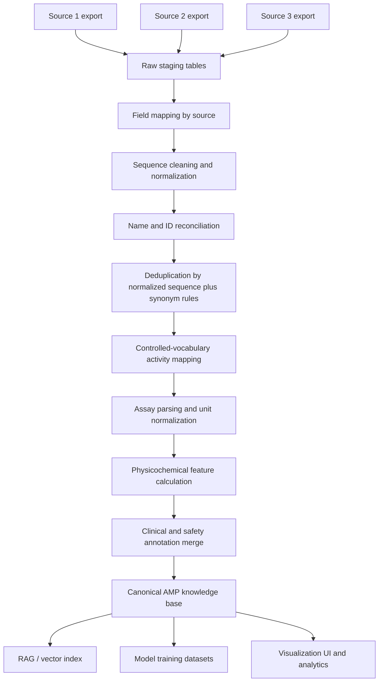

# AMP Database Schema and Three-Source Standardization Flow

This document captures a practical data model and ETL flow for building an antimicrobial peptide (AMP) knowledge base from three upstream AMP databases.

## 1. Scope and design goals

The integrated database should support four main workflows:

1. **Database lookup** for known AMP sequences and annotations.
2. **RAG retrieval** for downstream QA and evidence-grounded responses.
3. **Model training** for sequence analysis, ranking, and conditional generation.
4. **UI visualization** for filtering, comparison, and candidate review.

To support these workflows, the schema separates:

- **canonical sequence records**
- **source-specific raw records**
- **normalized activity / assay annotations**
- **physicochemical features**
- **clinical / safety metadata**
- **traceability back to the original source**

## 2. Recommended logical schema

A relational schema is the most maintainable starting point. A vector index can then be added for semantic retrieval.

### 2.1 Core tables

#### `amp_sequence`
Canonical peptide-level table.

| Field | Type | Description |
| --- | --- | --- |
| `amp_id` | UUID / BIGINT | Internal primary key |
| `canonical_name` | TEXT | Preferred peptide name |
| `canonical_sequence` | TEXT | Standardized amino-acid sequence |
| `sequence_length` | INT | Sequence length after normalization |
| `source_count` | INT | Number of upstream sources supporting this peptide |
| `has_nonstandard_residue` | BOOLEAN | Whether ambiguous / modified residues remain |
| `is_cyclic` | BOOLEAN | Whether the peptide is cyclic |
| `has_disulfide_bond` | BOOLEAN | Whether cysteine pairing is reported / inferred |
| `modification_summary` | TEXT | Free-text summary of modifications |
| `organism_source` | TEXT | Source organism if known |
| `evidence_level` | TEXT | Experimental / literature / inferred |
| `created_at` | TIMESTAMP | Record creation time |
| `updated_at` | TIMESTAMP | Record update time |

#### `amp_source_record`
Stores one raw/normalized record per upstream database entry.

| Field | Type | Description |
| --- | --- | --- |
| `source_record_id` | UUID / BIGINT | Primary key |
| `amp_id` | FK | Links to `amp_sequence` |
| `source_db` | TEXT | e.g. APD, DRAMP, DBAASP |
| `source_accession` | TEXT | Original database ID |
| `source_name` | TEXT | Original peptide name |
| `raw_sequence` | TEXT | Original sequence before normalization |
| `normalized_sequence` | TEXT | Cleaned sequence used for deduplication |
| `raw_activity_text` | TEXT | Original activity description |
| `raw_target_text` | TEXT | Original target description |
| `raw_metadata_json` | JSON / JSONB | Extra fields preserved losslessly |
| `source_url` | TEXT | Source page / citation URL |
| `version_tag` | TEXT | Optional source release version |
| `ingested_at` | TIMESTAMP | ETL ingestion time |

#### `amp_activity_annotation`
Normalized biological activity labels.

| Field | Type | Description |
| --- | --- | --- |
| `activity_id` | UUID / BIGINT | Primary key |
| `amp_id` | FK | Linked peptide |
| `activity_type` | TEXT | antibacterial / antifungal / antiviral / antibiofilm / immunomodulatory |
| `target_group` | TEXT | Gram+ / Gram- / fungi / virus / biofilm / mixed |
| `target_organism` | TEXT | Specific organism name if available |
| `mechanism_label` | TEXT | membrane disruption / intracellular target / unknown |
| `activity_confidence` | TEXT | curated / direct-source / inferred |
| `annotation_source` | TEXT | Rule / manual / source database |

#### `amp_assay_result`
Stores assay-specific quantitative evidence.

| Field | Type | Description |
| --- | --- | --- |
| `assay_id` | UUID / BIGINT | Primary key |
| `amp_id` | FK | Linked peptide |
| `assay_type` | TEXT | MIC / MBC / IC50 / EC50 / hemolysis |
| `value_numeric` | FLOAT | Parsed numeric value |
| `value_text` | TEXT | Original value text |
| `unit` | TEXT | Standardized unit |
| `target_organism` | TEXT | Assay target |
| `condition_text` | TEXT | Temperature / medium / pH / strain notes |
| `source_record_id` | FK | Traceability to raw source |

#### `amp_physchem_feature`
Derived sequence descriptors for training and filtering.

| Field | Type | Description |
| --- | --- | --- |
| `feature_id` | UUID / BIGINT | Primary key |
| `amp_id` | FK | Linked peptide |
| `net_charge_ph74` | FLOAT | Net charge at pH 7.4 |
| `gravy` | FLOAT | Hydrophobicity score |
| `isoelectric_point` | FLOAT | pI |
| `molecular_weight` | FLOAT | Molecular weight |
| `aromaticity` | FLOAT | Aromaticity |
| `instability_index` | FLOAT | Instability index |
| `aliphatic_index` | FLOAT | Aliphatic index |
| `boman_index` | FLOAT | Protein-binding potential |
| `hydrophobic_moment` | FLOAT | Amphipathicity estimate |
| `predicted_secondary_structure` | TEXT | alpha-helix / beta-sheet / mixed / other |
| `feature_method` | TEXT | Script / package / model used |

#### `amp_safety_clinical`
Safety and development metadata.

| Field | Type | Description |
| --- | --- | --- |
| `safety_id` | UUID / BIGINT | Primary key |
| `amp_id` | FK | Linked peptide |
| `hemolysis_level` | TEXT | low / medium / high / unknown |
| `cytotoxicity_note` | TEXT | Free-text toxicity summary |
| `serum_stability_note` | TEXT | Stability annotation |
| `protease_resistance_note` | TEXT | Protease resistance annotation |
| `clinical_stage` | TEXT | preclinical / phase I / phase II / marketed |
| `medical_use` | TEXT | Indication or use case |
| `safety_source` | TEXT | Database / literature / manual curation |

#### `amp_embedding`
Optional table for vector retrieval.

| Field | Type | Description |
| --- | --- | --- |
| `embedding_id` | UUID / BIGINT | Primary key |
| `amp_id` | FK | Linked peptide |
| `embedding_model` | TEXT | Protein LM / text embedding model |
| `embedding_vector` | VECTOR / BLOB | Stored vector |
| `embedding_text` | TEXT | Text used to generate embedding |
| `created_at` | TIMESTAMP | Indexing time |

## 3. Normalization rules

### 3.1 Sequence normalization

Apply a deterministic normalization pipeline before deduplication:

1. Uppercase the sequence.
2. Remove whitespace and formatting characters.
3. Convert source-specific separators or annotation tokens into structured metadata.
4. Split or flag terminal modifications rather than mixing them into the raw sequence field.
5. Preserve unusual residues in a separate metadata field if they cannot be mapped safely.
6. Generate:
   - `raw_sequence`
   - `normalized_sequence`
   - `canonical_sequence`

### 3.2 Name normalization

- Preserve original names in `amp_source_record.source_name`.
- Select a preferred `canonical_name` by source priority + completeness.
- Track synonyms in `raw_metadata_json` or a dedicated synonym table if needed.

### 3.3 Activity normalization

Map inconsistent source labels into a controlled vocabulary.

Example mapping:

- `anti-Gram+`, `Gram positive`, `active against Gram positive bacteria` → `target_group = Gram+`
- `antibacterial`, `anti-bacterial`, `bactericidal` → `activity_type = antibacterial`
- `biofilm inhibition`, `anti-biofilm` → `activity_type = antibiofilm`

### 3.4 Unit normalization

Standardize quantitative fields while preserving source text.

- Store parsed values in `value_numeric`
- Store the original string in `value_text`
- Convert units to a preferred standard where possible
- Mark unparsed values explicitly instead of dropping them silently

## 4. Three-source integration and standardization flow

## 5. ETL stages in practice

### Stage A: Raw ingestion

For each upstream database, store a lossless raw extract before transformation.

Outputs:
- raw export files
- source-specific parsing scripts
- ingestion log with row counts and parse failures

### Stage B: Source mapping

Map each source into a shared intermediate schema.

Outputs:
- source-specific field map
- normalized columns such as `source_db`, `source_accession`, `raw_sequence`, `raw_activity_text`

### Stage C: Deduplication and canonicalization

Primary rule:
- deduplicate by normalized sequence first

Secondary rules:
- merge equivalent names as synonyms
- flag conflicts rather than forcing silent merges

Outputs:
- canonical peptide table
- duplicate-cluster report
- unresolved conflict list for manual review

### Stage D: Annotation enrichment

Add:
- computed physicochemical features
- normalized activity labels
- clinical and safety metadata
- evidence and provenance tags

### Stage E: Productization

Materialize derived views for three downstream consumers:

1. **analytics/UI view** for filters and charts
2. **RAG text chunks** for grounded QA
3. **training examples** for instruction tuning and ranking tasks

## 6. Recommended downstream data products

### 6.1 Analytics table
A flattened table for dashboards and filtering.

Suggested export name:
- `annotated_amp_database.csv`

### 6.2 RAG document store
Each record can be rendered as a compact evidence block:
- peptide name
- canonical sequence
- activity summary
- target organisms
- clinical stage
- source provenance

### 6.3 Training datasets
Separate training sets by task:

- **classification**: AMP vs non-AMP, toxicity, hemolysis
- **retrieval/ranking**: similar sequence or similar profile lookup
- **instruction tuning**: explain sequence properties, summarize evidence, propose candidates under constraints
- **generation**: conditional design with downstream filtering and scoring

## 7. GitHub repository update recommendation

If this documentation is being maintained in a GitHub repository, the minimum update should include:

1. a dedicated design document like this file
2. a README link to the schema and ETL flow
3. a folder convention such as:
   - `docs/`
   - `data/raw/`
   - `data/processed/`
   - `scripts/etl/`
   - `scripts/features/`
   - `app/`
4. versioned source-mapping configuration files per upstream database

## 8. Suggested next deliverables

1. Source-to-schema field mapping tables for the three specific AMP databases.
2. An ETL script that emits the canonical schema.
3. A feature-generation script that computes physicochemical descriptors.
4. A RAG-ready text export and metadata index.
5. A lightweight UI for query, sequence analysis, and candidate review.
